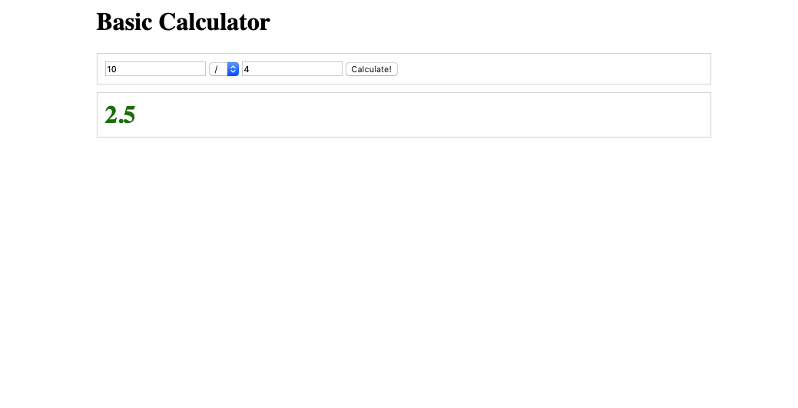

# Web calculator
> A simple web calculator right in your browser using `html5`, `css` and **vanilla** `javascript` tools.
>
>It was made in easy-way just for fun!

## Usage

- Open [calcOne.html](calcOne.html) file in your browser.

- Open [calcTwo.html](calcTwo.html) file in your browser.

## Meta

Author - Volodymyr Yahello

You can reach out me via:
* email - [vyahello@gmail.com](vyahello@gmail.com)
* github - [https://github.com/vyahello](https://github.com/vyahello)
* linkedin -  [https://www.linkedin.com/in/volodymyr-yahello-821746127](https://www.linkedin.com/in/volodymyr-yahello-821746127)

## Contributing

1. Fork it (https://github.com/vyahello/old-style-google)
2. Create your feature branch (`git checkout -b feature/fooBar`)
3. Commit your changes (`git commit -am 'Add some fooBar'`)
4. Push to the branch (`git push origin feature/fooBar`)
5. Create a new Pull Request
